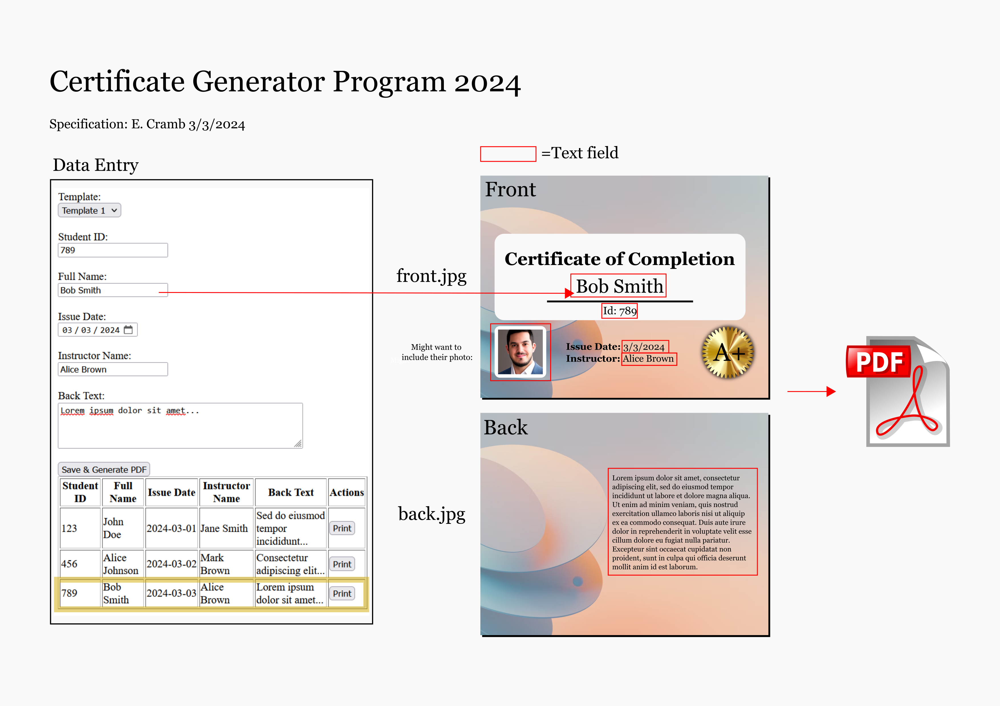

# CertWizard

An open-source web application for generating PDFs of diplomas or certificates of completion. 

## Roadmap

- User login
- Select from one of many certificate templates
- Two-sided templates; front and back-side (both JPG images)
- Add to template any number of text fields
- Generate a PDF of the certificate
- All certificates issued are saved to a SQL table for later retrieval and re-printing
- Expandable: Add more templates and text fields

## Concept Art

